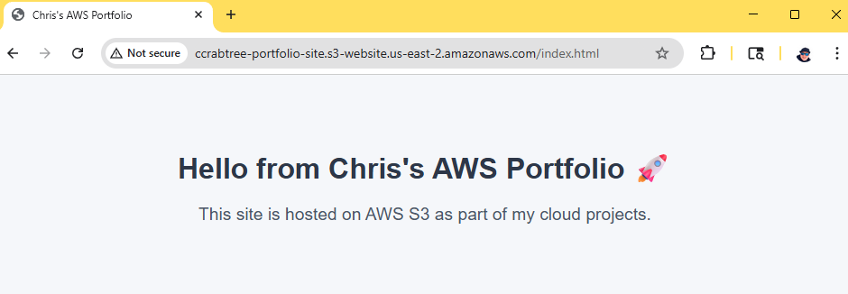
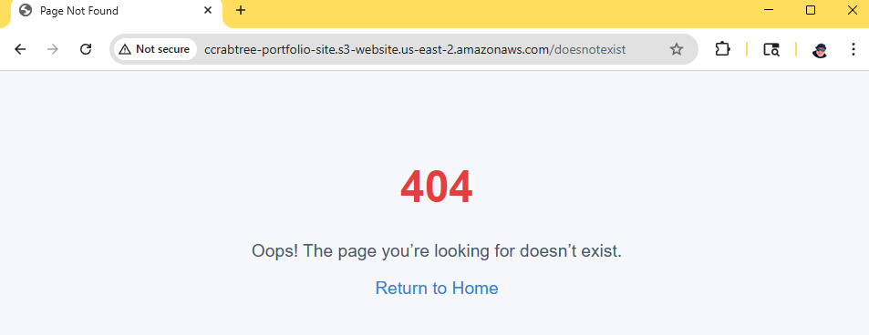

# Project 1 – Static Website Hosting on AWS S3

## Overview
This project demonstrates how I hosted a static website using Amazon S3. The site includes a simple index page and a custom error page. The goal was to show how to configure S3 for static hosting, make the content publicly available, and handle errors cleanly.

---

## Architecture


---

## Steps I Took
1. Created an S3 bucket  
   - Name: `ccrabtree-portfolio-site`  
   - Region: `us-east-2` (Ohio)  
   - Turned off “Block all public access” so the bucket could be used for static hosting  

2. Enabled static website hosting in bucket properties  
   - Index document: `index.html`  
   - Error document: `error.html`  

3. Uploaded the website files  
   - `index.html` – basic homepage  
   - `error.html` – 404 page with a link back to home  

4. Added a bucket policy for public read access:
   ```json
   {
     "Version": "2012-10-17",
     "Statement": [
       {
         "Sid": "PublicReadForWebsite",
         "Effect": "Allow",
         "Principal": "*",
         "Action": "s3:GetObject",
         "Resource": "arn:aws:s3:::ccrabtree-portfolio-site/*"
      }
     ]
   }


5. Tested the site  
   - Website endpoint:  
     http://ccrabtree-portfolio-site.s3-website.us-east-2.amazonaws.com/ 
   - Confirmed the index page loads and the error page appears on invalid paths  

---

## Screenshots
**Index page**  


**Error page**  


---

## Security Notes
- Public access limited to `s3:GetObject` (read-only).  
- Work done under IAM user (`chris-admin`), not the root account.  
- Root account is protected with MFA.  

---

## Cost
- S3 storage: Free Tier covers up to 5 GB  
- Static hosting: Free  
- Total monthly cost: $0 (under Free Tier or AWS credits)  

 
